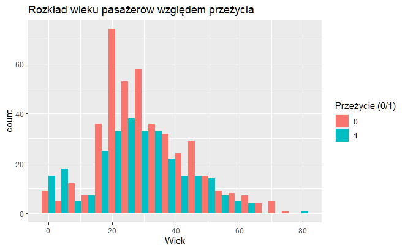
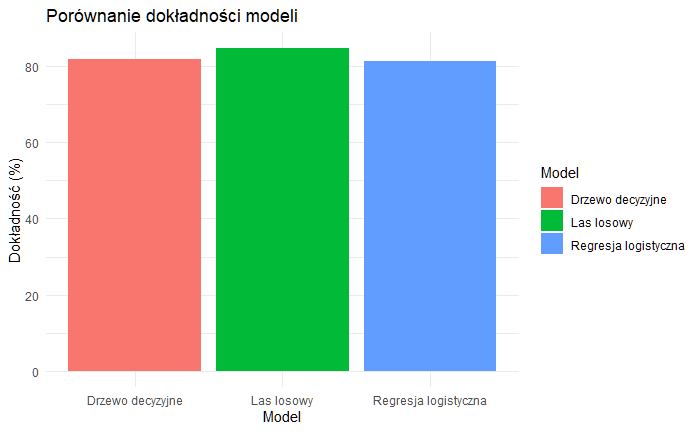

# Titanic Analysis Project

This project analyzes the survival data of Titanic passengers using statistical and machine learning models. The goal is to predict survival based on passenger characteristics such as gender, age, class, and fare.

## Project Structure

```
titanic-analysis-project/
├── project_titanic.Rmd      # R Markdown file containing the full analysis
├── project_titanic.html     # HTML report generated from the R Markdown
│accuracy-comparison.png
│age-vs-survival.png
```

## Analysis Overview

1. **Data Exploration**:
   - Initial exploration of the Titanic dataset, including summary statistics and visualizations.
   - Analysis of missing values and their treatment.

2. **Predictor Importance**:
   - Key predictors such as gender, age, and class were analyzed.
   - Visualizations, including histograms and feature importance plots, provided insights into survival factors.

3. **Modeling**:
   - Models implemented:
     - Logistic Regression
     - Decision Trees
     - Random Forests
   - Evaluation of model performance using accuracy on test datasets.

4. **Key Findings**:
   - Gender, age, and class are the most influential predictors of survival.
   - Random Forest outperformed other models with an accuracy of **84.65%**.

## Key Visualizations

### Age vs. Survival
- A histogram depicting the distribution of passenger ages based on survival status.



### Model Accuracy Comparison
- A bar chart comparing the accuracy of Logistic Regression, Decision Trees, and Random Forests.



## How to Run

1. Clone the repository:
   ```bash
   git clone https://github.com/HMurawski/titanic-analysis-project_R.git
   cd titanic-analysis-project_R

   ```

2. Open the R Markdown file (`project_titanic.Rmd`) in RStudio.

3. Install the required packages:
   ```R
   install.packages(c("titanic", "ggplot2", "randomForest", "tree"))
   ```

## Dataset
The dataset is sourced from the `titanic` package in R. It contains information about Titanic passengers, including:
- Survival (0 = No, 1 = Yes)
- Passenger class (1 = First, 2 = Second, 3 = Third)
- Gender
- Age
- Number of siblings/spouses aboard
- Number of parents/children aboard
- Fare paid

## Key Takeaways

1. **Gender**: Women had significantly higher chances of survival compared to men.
2. **Age**: Younger passengers were more likely to survive.
3. **Class**: Passengers in first class had the highest survival rate.
4. **Model Performance**:
   - Random Forest achieved the best accuracy (84.65%) among the tested models.


